# Prisma Schema Diagram (UML Class Diagram)

This document contains a full conceptual Schema Diagram for `schema.prisma` using UML Class Diagram formatting, excluding traditional ER/EER notation.

**Team collaboration notes**

* `ProjectMember` — not `Project.assigneeId` — is what grants access to a project.
  `assigneeId` is kept as the *project lead*: displayed and notified, kept in sync
  with this table, but no longer an authorization input. Unique per
  `(projectId, userId)`.
* `Comment.entityType` / `entityId` are polymorphic with no foreign key, the same
  pattern `AuditLog` uses, so one table serves projects and anything added later.
  `parentId` is a self-relation and threads are one level deep. Deletes are soft, so
  replies underneath a removed comment survive.
* `Task.completedAt` is cleared when a task is reopened, so a stale timestamp cannot
  outlive the `DONE` state.
* Author columns (`Comment.authorId`, `Task.createdBy`, `Note.createdBy`) are nullable
  with `onDelete: SetNull`: the record survives the deletion of the person who made
  it, matching how the audit trail already behaves.

```mermaid
classDiagram
    class Business {
        String id
        String name
        String defaultCurrency
        WorkspaceType workspaceType
        String invoicePrefix
        String invoiceSeparator
        Int invoiceSequence
        Int clientSequence
        Int projectSequence
        String emailSubjectTemplate
        String emailBodyTemplate
        String paymentInstructions
        String feedbackEmailSubjectTemplate
        String feedbackEmailBodyTemplate
        Boolean realtimeMessagesEnabled
        DateTime createdAt
        DateTime updatedAt
    }
    
    class User {
        String id
        String email
        String firstName
        String lastName
        String imageUrl
        Json navPreferences
        Json quickActionPreferences
        Json notificationPreferences
        DateTime createdAt
        DateTime updatedAt
    }

    class BusinessMembership {
        String id
        String businessId
        String userId
        String role
        Int weeklyCapacityHours
        DateTime createdAt
        DateTime updatedAt
    }

    class Client {
        String id
        String businessId
        String displayId
        String displayName
        String companyName
        String email
        String phone
        String industry
        String preferredChannel
        String preferredDeliveryMethod
        Int internalRating
        DateTime createdAt
        DateTime updatedAt
    }

    class Project {
        String id
        String businessId
        String displayId
        String clientId
        String title
        String type
        String priority
        DateTime deadline
        String statusStageId
        Int orderIndex
        Boolean isArchived
        DateTime createdAt
        DateTime updatedAt
        String assigneeId
    }

    class ProjectRequest {
        String id
        String businessId
        ProjectRequestStatus status
        String clientName
        String clientEmail
        String companyName
        String phone
        String industry
        String preferredChannel
        String projectTitle
        String projectType
        String scriptText
        String scriptLink
        String rawFootageLink
        DateTime resolvedAt
        DateTime createdAt
        DateTime updatedAt
    }

    class WorkflowTemplate {
        String id
        String businessId
        String name
        String projectType
        DateTime createdAt
        DateTime updatedAt
    }

    class WorkflowStage {
        String id
        String templateId
        String name
        Int orderIndex
        Int estimatedHours
        Boolean billingTrigger
        String icon
    }

    class ProjectStageHistory {
        String id
        String projectId
        String stageId
        DateTime enteredAt
        DateTime exitedAt
    }

    class Invoice {
        String id
        String businessId
        String clientId
        String projectId
        String invoiceNumber
        String currency
        Int subtotalCents
        Int taxRateBps
        Int taxAmountCents
        Int totalCents
        Int amountPaidCents
        Int amountDueCents
        Decimal fxRateSnapshot
        InvoiceStatus status
        String notes
        String pdfUrl
        DateTime issuedAt
        DateTime dueDate
        DateTime paidAt
        DateTime emailSentAt
        Int reminderCount
        DateTime createdAt
        DateTime updatedAt
    }

    class InvoiceLineItem {
        String id
        String invoiceId
        String description
        Int quantity
        Int amountCents
        String sourceType
        String sourceId
    }

    class Payment {
        String id
        String businessId
        String invoiceId
        Int amountCents
        PaymentMethod method
        String reference
        DateTime reconciledAt
        String reconciledByUserId
        DateTime createdAt
        DateTime updatedAt
    }

    class Expense {
        String id
        String businessId
        String projectId
        Int amountCents
        String currency
        Decimal fxRateSnapshot
        String category
        String description
        DateTime dateIncurred
        DateTime createdAt
        DateTime updatedAt
    }

    class CreditNote {
        String id
        String businessId
        String originalInvoiceId
        Int amountCents
        String reason
        DateTime createdAt
    }

    class InvoiceReminder {
        String id
        String businessId
        String invoiceId
        String tone
        String channel
        DateTime createdAt
    }

    class AuditLog {
        String id
        String businessId
        String entityType
        String entityId
        String action
        String actorUserId
        String metadataJson
        DateTime createdAt
    }

    class Note {
        String id
        String projectId
        String type
        String content
        DateTime createdAt
        DateTime updatedAt
    }

    class TimeEntry {
        String id
        String projectId
        String userId
        DateTime startedAt
        DateTime endedAt
        Int durationMinutes
        Boolean isBillable
        String source
        DateTime createdAt
        DateTime updatedAt
    }

    class Asset {
        String id
        String businessId
        String type
        String name
        String vendor
        String licenseType
        DateTime expiresAt
        Int cost
        DateTime createdAt
        DateTime updatedAt
    }

    class ProjectAsset {
        String id
        String projectId
        String assetId
        DateTime createdAt
    }

    class ProjectLink {
        String id
        String projectId
        String url
        String label
        DateTime createdAt
    }

    class Notification {
        String id
        String businessId
        String userId
        String title
        String message
        String type
        Boolean isRead
        String actionUrl
        DateTime createdAt
    }

    class FeedbackRequest {
        String id
        String businessId
        String projectId
        String clientId
        String token
        String status
        DateTime sentAt
        DateTime responseDeadline
        DateTime createdAt
        DateTime updatedAt
    }

    class FeedbackResponse {
        String id
        String businessId
        String requestId
        Int overallScore
        Json dimensionScores
        String commentText
        String videoUrl
        Boolean consentToPublish
        DateTime submittedAt
        DateTime createdAt
        DateTime updatedAt
    }

    class Testimonial {
        String id
        String businessId
        String feedbackResponseId
        String projectId
        String clientId
        String displayText
        String videoRef
        Boolean isPublished
        DateTime publishedAt
        DateTime createdAt
        DateTime updatedAt
    }

    class ReviewRequest {
        String id
        String businessId
        String projectId
        String clientId
        String token
        String draftLink
        String status
        String clientNotes
        String clientLinks
        DateTime createdAt
        DateTime updatedAt
    }

    class AnalyticsSnapshot {
        String id
        String businessId
        DateTime date
        Int revenueMTDCents
        Int revenueLastMonthCents
        Float revenueDelta
        Int outstandingCents
        Int overdueCents
        Float utilization
        Int atRiskCount
        Float avgFeedback
        Float dso
        Json historicalTrendJson
        DateTime createdAt
    }

    class ProjectMember {
        String id
        String projectId
        String userId
        ProjectMemberRole role
        String addedBy
        DateTime createdAt
    }

    class Task {
        String id
        String businessId
        String projectId
        String title
        String description
        TaskStatus status
        String assigneeId
        DateTime dueDate
        Int orderIndex
        String createdBy
        DateTime completedAt
        DateTime createdAt
        DateTime updatedAt
    }

    class Comment {
        String id
        String businessId
        String entityType
        String entityId
        String authorId
        String body
        String parentId
        DateTime createdAt
        DateTime editedAt
        DateTime deletedAt
    }

    class Mention {
        String id
        String commentId
        String mentionedUserId
        DateTime readAt
        DateTime createdAt
    }

    class Conversation {
        String id
        String businessId
        ConversationType type
        String title
        Boolean slowModeEnabled
        Int slowModeCooldown
        String createdBy
        DateTime createdAt
    }

    class ConversationParticipant {
        String id
        String conversationId
        String userId
        Boolean isMuted
        DateTime lastReadAt
        DateTime deletedAt
        DateTime joinedAt
    }

    class Message {
        String id
        String conversationId
        String senderId
        String content
        DateTime createdAt
        DateTime deletedAt
    }

    Business "1" --> "*" BusinessMembership : has
    User "1" --> "*" BusinessMembership : joins
    Business "1" --> "*" Client : manages
    Business "1" --> "*" Project : owns
    Business "1" --> "*" WorkflowTemplate : defines
    Business "1" --> "*" Invoice : issues
    Business "1" --> "*" Asset : catalogs
    Business "1" --> "*" Payment : receives
    Business "1" --> "*" Expense : logs
    Business "1" --> "*" CreditNote : issues
    Business "1" --> "*" InvoiceReminder : tracks
    Business "1" --> "*" AuditLog : audits
    Business "1" --> "*" Notification : broadcasts
    Business "1" --> "*" FeedbackRequest : queries
    Business "1" --> "*" FeedbackResponse : collects
    Business "1" --> "*" Testimonial : features
    Business "1" --> "*" ReviewRequest : requests
    Business "1" --> "*" AnalyticsSnapshot : records
    Business "1" --> "*" ProjectRequest : intakes
    Business "1" --> "*" Conversation : hosts

    Client "1" --> "*" ProjectRequest : submits
    Client "1" --> "*" Project : requests
    Client "1" --> "*" Invoice : receives
    Client "1" --> "*" FeedbackRequest : fills
    Client "1" --> "*" Testimonial : provides
    Client "1" --> "*" ReviewRequest : reviews

    ProjectRequest "1" --> "1" Project : approves to

    Project "*" --> "1" WorkflowStage : current
    Project "1" --> "*" ProjectStageHistory : history
    Project "1" --> "*" Invoice : mapped to
    Project "1" --> "*" Note : contains
    Project "1" --> "*" ProjectLink : attached
    Project "1" --> "*" TimeEntry : incurs
    Project "1" --> "*" ProjectAsset : consumes
    Project "1" --> "*" Expense : incurs
    Project "1" --> "*" FeedbackRequest : yields
    Project "1" --> "*" Testimonial : yields
    Project "1" --> "*" ReviewRequest : yields

    WorkflowTemplate "1" --> "*" WorkflowStage : shapes
    WorkflowStage "1" --> "*" ProjectStageHistory : tracked in
    
    Invoice "1" --> "*" InvoiceLineItem : line items
    Invoice "1" --> "*" Payment : payments
    Invoice "1" --> "*" CreditNote : adjustments
    Invoice "1" --> "*" InvoiceReminder : reminders
    
    Asset "1" --> "*" ProjectAsset : usages
    
    User "1" --> "*" Notification : receives
    User "1" --> "*" Project : assigned to
    User "1" --> "*" ConversationParticipant : acts as
    User "1" --> "*" Message : sends
    User "1" --> "*" TimeEntry : logs

    FeedbackRequest "1" --> "1" FeedbackResponse : captures
    FeedbackResponse "1" --> "1" Testimonial : spawns

    Conversation "1" --> "*" ConversationParticipant : participants
    Conversation "1" --> "*" Message : messages

    %% Team collaboration
    Project "1" --> "*" ProjectMember : grants access via
    Project "1" --> "*" Task : breaks down into
    Business "1" --> "*" Task : owns
    Business "1" --> "*" Comment : owns
    User "1" --> "*" ProjectMember : belongs to projects
    User "1" --> "*" Task : assigned
    User "1" --> "*" Comment : authors
    User "1" --> "*" Mention : mentioned in
    User "1" --> "*" Note : authors
    Comment "1" --> "*" Comment : replies
    Comment "1" --> "*" Mention : notifies
```

