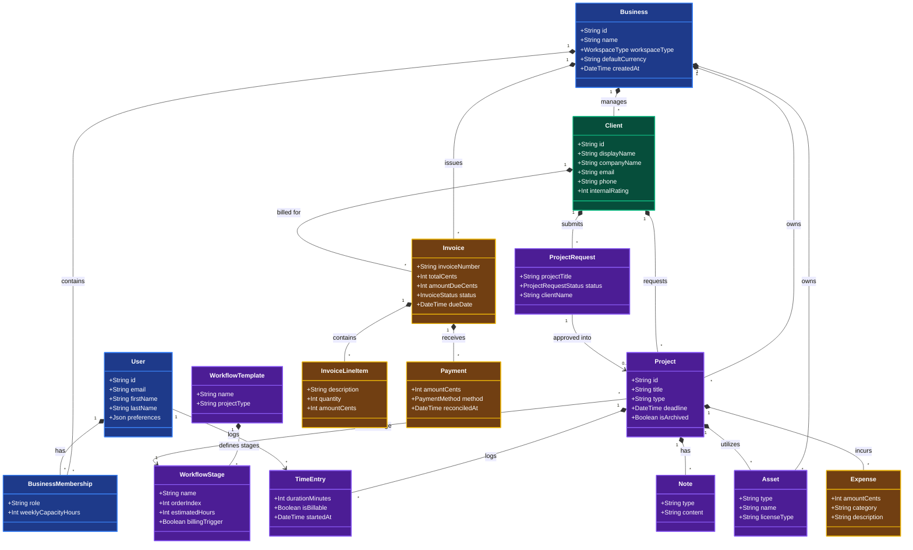
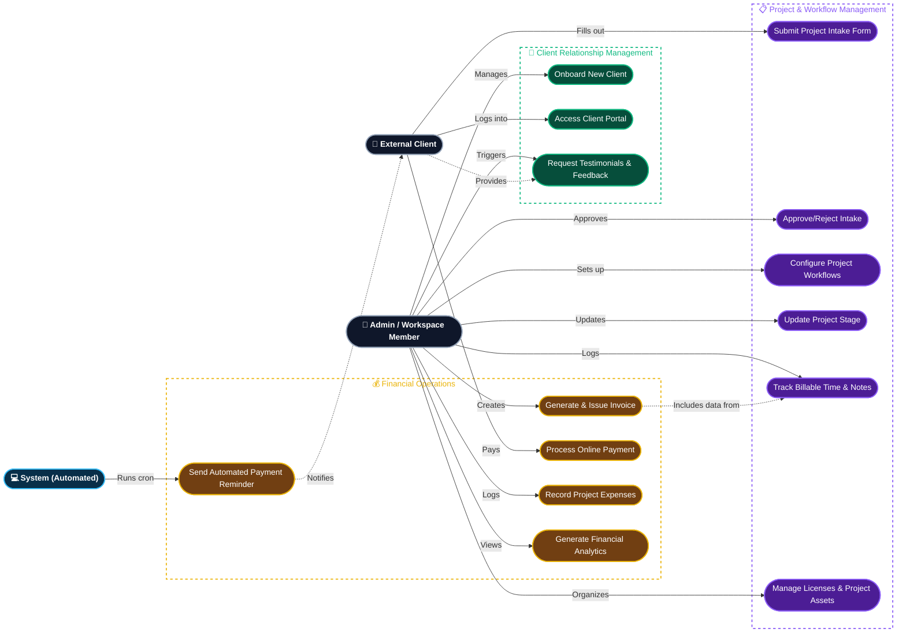

# System Diagrams

This document contains visually enhanced, professional-level Class and Use Case diagrams for the Cutline Business Manager project.

## Class Diagram

This diagram represents the core data entities and their cardinality. The classes are color-coded to visually separate functional domains, using dark, rich backgrounds with white text to ensure perfect visibility in both light and dark themes.

**Legend:**
🟦 **Core & Multi-Tenancy** | 🟩 **Client Management** | 🟪 **Project Management** | 🟨 **Financials**

## Use Case Diagram

This diagram outlines specific, high-level business processes executed by our primary actors: Admin/Workspace Members, External Clients, and Automated System triggers. Subgraph backgrounds have been made transparent so they don't clash with your environment theme.

